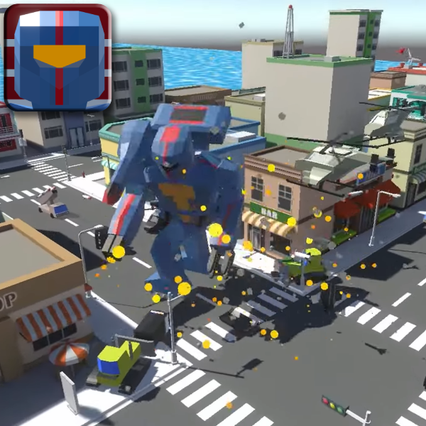

## Hello, ny name is Wojtek a.k.a HushPix :cat:

I am an aspiring artist and gamedeveloper. 
While programming might not be my cup of tea, i still do enjoy working with game engines.
As for art i do enjoy making pixelart, traditional drawings and videos.
For the time being I am a student of Digital Technologies in Animation of Culture.

### How to contact me? :incoming_envelope: :mailbox_with_no_mail:

You can reach me at hushpix03@protonmail.com, although it might take some time for me to respond.

## Projects of mine or that I've worked on

### Robo Demolition

Robo demolition is a mobile game inspired by titles like "Vampire Survivors" or "Survivor IO".
It offers a variety of enemies, and weapons for the player to experience. 
I worked on the visuals in this Project.

    

## Software that I use and recommend

<!--
**HushPix/HushPix** is a ✨ _special_ ✨ repository because its `README.md` (this file) appears on your GitHub profile.

Here are some ideas to get you started:

- 🔭 I’m currently working on ...
- 🌱 I’m currently learning ...
- 👯 I’m looking to collaborate on ...
- 🤔 I’m looking for help with ...
- 💬 Ask me about ...
- 📫 How to reach me: ...
- 😄 Pronouns: ...
- ⚡ Fun fact: ...
-->
